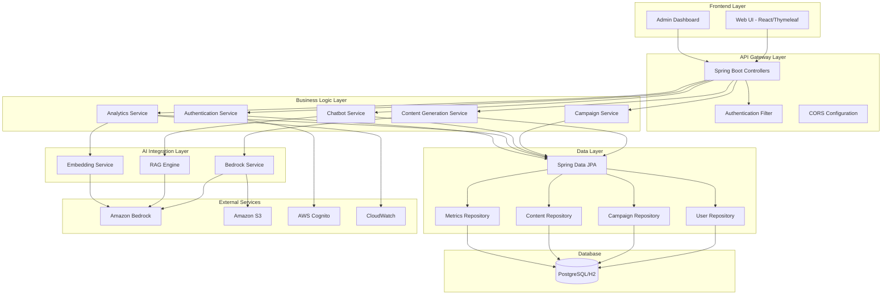

# MaKIT - AI 마케팅 플랫폼

Human.Ai.D의 AI 기반 마케팅 자동화 플랫폼입니다. 콘텐츠 생성, 고객 참여, 캠페인 분석 등 핵심 마케팅 기능을 AI로 강화하여 제공합니다.

## 🚀 빠른 시작

### 1. 환경 설정
```bash
# 프로젝트 클론
git clone <repository-url>
cd Make.IT_Ai-Assistant_platform

# 설정 스크립트 실행
./scripts/setup.sh
```

### 2. 애플리케이션 실행
```bash
# Docker Compose로 전체 스택 실행
docker-compose up -d

# 또는 개발 모드로 실행
cd backend && mvn spring-boot:run
```

### 3. 접속
- **프론트엔드**: http://localhost
- **백엔드 API**: http://localhost:8080
- **API 문서**: http://localhost:8080/swagger-ui.html

## 📁 프로젝트 구조

```
Make.IT_Ai-Assistant_platform/
├── backend/                 # Spring Boot 백엔드
├── frontend/               # 웹 프론트엔드
├── docs/                   # 프로젝트 문서
├── scripts/                # 배포 및 설정 스크립트
├── docker-compose.yml      # Docker Compose 설정
└── README.md              # 이 파일
```

자세한 구조는 [PROJECT_STRUCTURE.md](docs/PROJECT_STRUCTURE.md)를 참조하세요.

## 🎯 주요 기능

### AX Data Intelligence
- 자연어 기반 데이터 분석
- 유튜브 댓글 및 영향력 분석
- 웹사이트 콘텐츠 분석
- 키워드 기반 채널 검색

### AX Marketing Intelligence  
- AI 기반 콘텐츠 생성
- 인스타그램 피드 자동 생성
- 이미지 배경 제거
- 콘텐츠 최적화

### AX Commerce Brain
- 지능형 고객 응대 챗봇
- 상품 리뷰 감정 분석
- AI 모델컷 이미지 생성
- 이커머스 통합 솔루션

## 🛠️ 기술 스택

### 백엔드
- **Java 21** + **Spring Boot 3.2.0**
- **PostgreSQL** (프로덕션) / **H2** (개발)
- **Redis** (캐싱)
- **AWS SDK** (Bedrock, S3, Cognito)
- **JWT** 인증

### 프론트엔드
- **HTML5/CSS3/JavaScript**
- **반응형 디자인**
- **Nginx** 서버

### 인프라
- **Docker & Docker Compose**
- **AWS 클라우드 서비스**
- **CI/CD 파이프라인**

## 🔧 개발 환경

### 필수 요구사항
- Java 21+
- Maven 3.6+
- Docker & Docker Compose
- Node.js 18+ (선택사항)

### 환경 변수 설정
```bash
# .env 파일 생성
AWS_REGION=ap-northeast-2
AWS_ACCESS_KEY_ID=your_access_key
AWS_SECRET_ACCESS_KEY=your_secret_key
```

## 🚀 AWS 배포

### ECS 배포 (권장)
```bash
# ECR 리포지토리 생성 후
./scripts/deploy-aws.sh
```

### EC2 배포
```bash
# EC2 인스턴스에서
docker-compose up -d
```

## 📊 API 문서

백엔드 서버 실행 후 다음 URL에서 API 문서를 확인할 수 있습니다:
- Swagger UI: http://localhost:8080/swagger-ui.html
- OpenAPI JSON: http://localhost:8080/v3/api-docs

## 🧪 테스트

```bash
# 단위 테스트
cd backend && mvn test

# 통합 테스트
cd backend && mvn verify

# 전체 테스트 (커버리지 포함)
cd backend && mvn clean test jacoco:report
```

## 📈 모니터링

- **헬스체크**: `/actuator/health`
- **메트릭**: `/actuator/metrics`
- **로그**: Docker 볼륨 또는 CloudWatch

## 🤝 기여하기

1. Fork the Project
2. Create your Feature Branch (`git checkout -b feature/AmazingFeature`)
3. Commit your Changes (`git commit -m 'Add some AmazingFeature'`)
4. Push to the Branch (`git push origin feature/AmazingFeature`)
5. Open a Pull Request

## 📄 라이선스

이 프로젝트는 MIT 라이선스 하에 배포됩니다. 자세한 내용은 `LICENSE` 파일을 참조하세요.

## 📞 지원

- **이슈 리포트**: GitHub Issues
- **문의**: contact@Human.Ai.D.com
- **문서**: [프로젝트 위키](docs/)

---

## 설계 문서

The MarKIT platform enhancement focuses on improving the existing AI-powered marketing automation system by strengthening core capabilities including content generation, customer engagement through chatbots, campaign analytics, and user experience. This design leverages the existing Spring Boot architecture while introducing advanced AI capabilities through Amazon Bedrock integration, enhanced security through AWS services, and improved scalability patterns.

The platform follows a microservice-oriented architecture within a monolithic Spring Boot application, utilizing domain-driven design principles with clear separation of concerns between content generation, campaign management, user management, and AI services.

## Architecture

### High-Level Architecture



### Component Architecture

The system is organized into distinct layers with clear responsibilities:

1. **Presentation Layer**: Handles user interactions and API endpoints
2. **Business Logic Layer**: Contains core business rules and orchestration
3. **AI Integration Layer**: Manages all AI-related operations and external AI service calls
4. **Data Access Layer**: Handles data persistence and retrieval
5. **Infrastructure Layer**: Manages external service integrations and cross-cutting concerns

## Components and Interfaces

### Enhanced Content Generation Module

**Purpose**: Extends existing content generation capabilities with multimodal content generation, template management, and advanced AI model selection.

**Key Components**:
- `EnhancedContentGenerationService`: Orchestrates content generation workflows
- `ContentTemplateManager`: Manages reusable content templates
- `MultimodalContentProcessor`: Handles combined text and image generation
- `ContentQualityAnalyzer`: Evaluates generated content quality

**Interfaces**:
```java
public interface ContentGenerationStrategy {
    CompletableFuture<Content> generateContent(ContentRequest request, User user);
    boolean supports(ContentType type);
    String getModelId();
}

public interface ContentTemplate {
    String getTemplateId();
    String getPromptTemplate();
    Map<String, Object> getDefaultParameters();
    ContentType getContentType();
}
```

### RAG-Enabled Chatbot Module

**Purpose**: Implements intelligent customer support through Retrieval Augmented Generation, enabling context-aware responses based on company knowledge base.

**Key Components**:
- `RAGChatbotService`: Main chatbot orchestration service
- `KnowledgeBaseManager`: Manages company-specific knowledge documents
- `ConversationContextManager`: Maintains conversation state and history
- `IntentClassifier`: Determines user intent and routes conversations

**Interfaces**:
```java
public interface ChatbotEngine {
    ChatResponse processMessage(ChatMessage message, ConversationContext context);
    void updateKnowledgeBase(List<Document> documents);
    ConversationContext createContext(User user);
}

public interface KnowledgeRetriever {
    List<Document> retrieveRelevantDocuments(String query, int maxResults);
    void indexDocument(Document document);
    void updateIndex();
}
```

### Advanced Analytics Module

**Purpose**: Provides comprehensive campaign performance analysis, predictive insights, and optimization recommendations using AI-based analytics.

**Key Components**:
- `CampaignAnalyticsService`: Analyzes campaign performance metrics
- `PredictiveAnalyticsEngine`: Provides predictive and trend analysis
- `OptimizationRecommendationService`: Generates actionable improvement suggestions
- `AudienceSegmentationService`: Creates intelligent audience segments

**Interfaces**:
```java
public interface AnalyticsEngine {
    AnalyticsReport generateReport(Campaign campaign, DateRange dateRange);
    List<Recommendation> getOptimizationRecommendations(Campaign campaign);
    AudienceSegment createSegment(SegmentationCriteria criteria);
}

public interface MetricsCollector {
    void recordMetric(String metricName, double value, Map<String, String> tags);
    MetricsSummary getSummary(String metricName, DateRange dateRange);
}
```

### Enhanced Security and User Management

**Purpose**: Strengthens security through AWS Cognito integration, implements role-based access control, and provides comprehensive audit logging.

**Key Components**:
- `CognitoAuthenticationService`: Handles AWS Cognito integration
- `RoleBasedAccessController`: Manages permissions and access control
- `AuditLoggingService`: Tracks user actions and system events
- `SecurityConfigurationManager`: Manages security policies

## Data Models

### Enhanced User Model
```java
@Entity
public class User {
    // Existing fields...
    
    @Enumerated(EnumType.STRING)
    private UserRole role;
    
    private String cognitoUserId;
    private String companyId;
    private Map<String, Object> preferences;
    private LocalDateTime lastLoginAt;
    private boolean isActive;
    
    @OneToMany(mappedBy = "user")
    private List<AuditLog> auditLogs;
}

public enum UserRole {
    ADMIN, MARKETING_MANAGER, CONTENT_CREATOR, ANALYST, VIEWER
}
```

### Conversation Context Model
```java
@Entity
public class ConversationContext {
    @Id
    private String contextId;
    
    @ManyToOne
    private User user;
    
    private String sessionId;
    private LocalDateTime startTime;
    private LocalDateTime lastActivity;
    
    @OneToMany(mappedBy = "context", cascade = CascadeType.ALL)
    private List<ChatMessage> messages;
    
    @ElementCollection
    private Map<String, String> contextVariables;
    
    private ConversationStatus status;
}
```

### Knowledge Base Document Model
```java
@Entity
public class KnowledgeDocument {
    @Id
    private String documentId;
    
    private String title;
    private String content;
    private String documentType;
    private String source;
    
    @ElementCollection
    private List<String> tags;
    
    private LocalDateTime indexedAt;
    private LocalDateTime lastUpdated;
    
    @Column(columnDefinition = "TEXT")
    private String embeddingVector;
    
    private DocumentStatus status;
}
```

### Analytics Models
```java
@Entity
public class CampaignAnalytics {
    @Id
    private Long id;
    
    @ManyToOne
    private Campaign campaign;
    
    private LocalDate reportDate;
    private Double impressions;
    private Double clicks;
    private Double conversions;
    private Double cost;
    private Double revenue;
    
    // Calculated metrics
    private Double clickThroughRate;
    private Double conversionRate;
    private Double returnOnAdSpend;
    
    private LocalDateTime calculatedAt;
}

@Entity
public class OptimizationRecommendation {
    @Id
    private Long id;
    
    @ManyToOne
    private Campaign campaign;
    
    private String recommendationType;
    private String description;
    private String actionRequired;
    private Double expectedImpact;
    private RecommendationPriority priority;
    
    private LocalDateTime generatedAt;
    private RecommendationStatus status;
}
```

## Error Handling

### Comprehensive Error Management Strategy

**AI Service Error Handling**:
- Implement circuit breaker pattern for Bedrock API calls
- Graceful degradation when AI services are unavailable
- Retry mechanisms with exponential backoff
- Fallback to cached or template-based responses

**Error Response Structure**:
```java
public class ApiErrorResponse {
    private String errorCode;
    private String message;
    private String details;
    private LocalDateTime timestamp;
    private String requestId;
    private Map<String, Object> metadata;
}
```

**Exception Hierarchy**:
```java
public class MarKITException extends RuntimeException {
    private final String errorCode;
    private final Map<String, Object> context;
}

public class ContentGenerationException extends MarKITException {}
public class ChatbotException extends MarKITException {}
public class AnalyticsException extends MarKITException {}
public class AuthenticationException extends MarKITException {}
```

**Error Handling Patterns**:
- Global exception handler using `@ControllerAdvice`
- Service-level error handling with proper logging
- Client-friendly error messages with technical details logged separately
- Automatic error reporting to CloudWatch for monitoring

## Testing Strategy

### Multi-Layer Testing Approach

**Unit Testing**:
- Service layer testing with mocked dependencies
- Repository testing with `@DataJpaTest`
- AI service testing with mock Bedrock responses
- Utility and helper class testing

**Integration Testing**:
- API endpoint testing with `@SpringBootTest`
- Database integration testing with test containers
- AWS service integration testing with LocalStack
- End-to-end workflow testing

**AI-Specific Testing**:
- Mock AI responses for consistent testing
- AI model performance benchmarking
- Content quality validation testing
- Chatbot conversation flow testing

**Performance Testing**:
- Load testing for content generation endpoints
- Stress testing for concurrent AI API calls
- Database performance testing under load
- Memory usage and garbage collection analysis

**Security Testing**:
- Authentication and authorization testing
- Input validation and sanitization testing
- SQL injection and XSS prevention testing
- AWS security configuration validation

### Test Data Management

**Test Data Strategy**:
- Synthetic test data generation for various scenarios
- Anonymized production data for realistic testing
- AI-generated test content for content validation
- Mock external service responses for isolated testing

**Testing Infrastructure**:
- Containerized test environments with Docker
- CI/CD pipeline integration with automated testing
- Test result reporting and coverage analysis
- Performance regression detection

This design provides a robust foundation for enhancing the MarKIT platform with advanced AI capabilities while maintaining security, scalability, and maintainability. The modular architecture allows for incremental development and easy integration of new features as requirements evolve.
